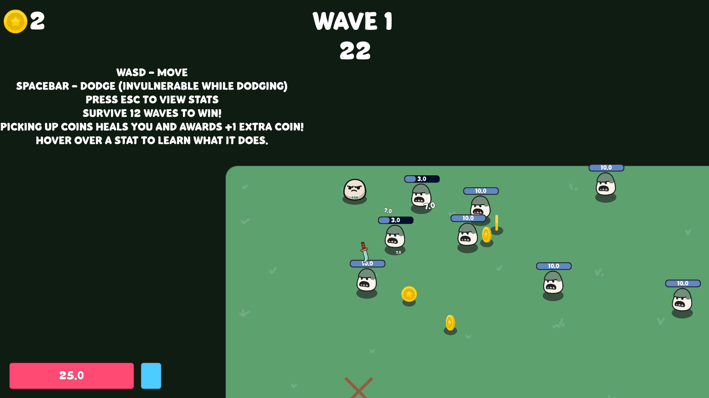
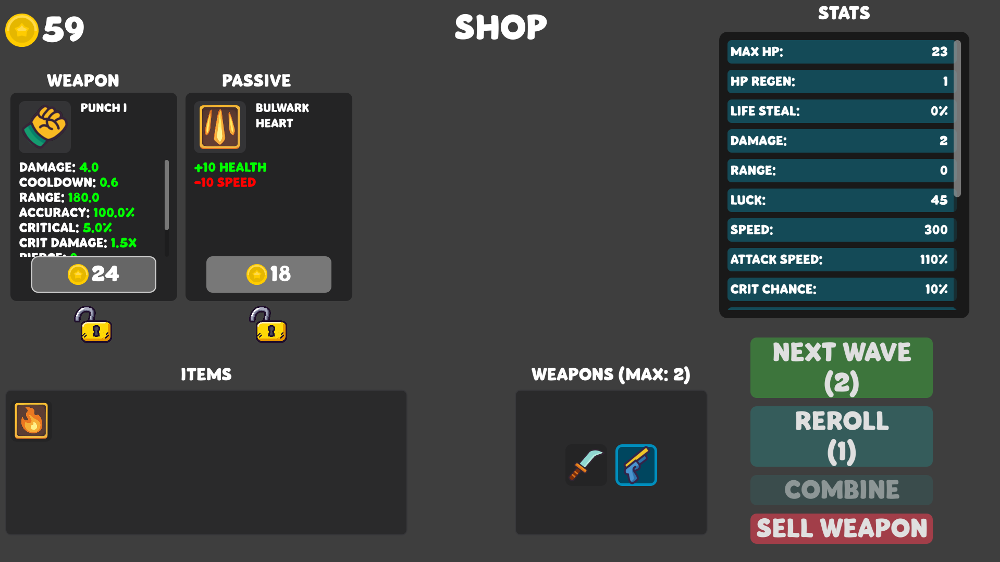
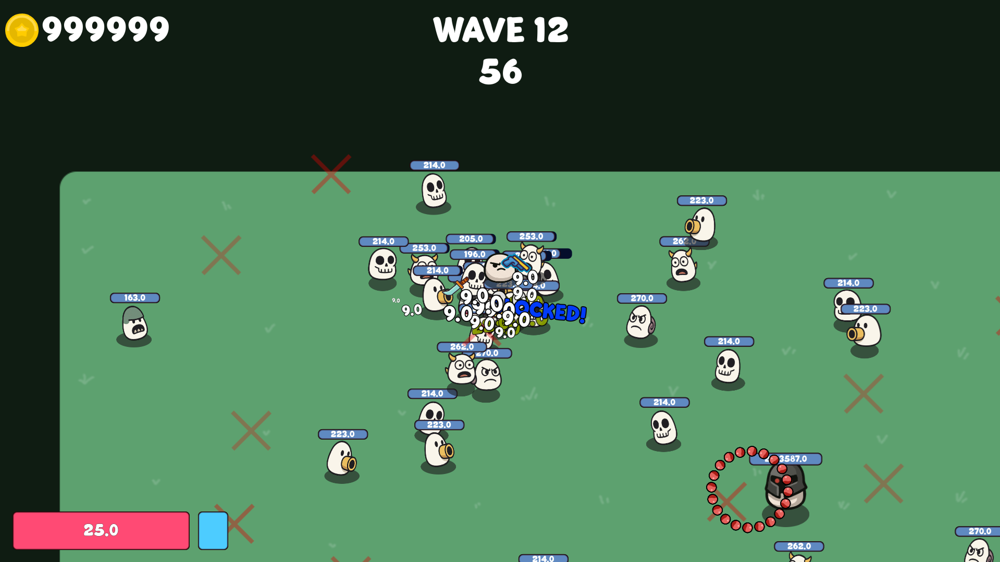

# Project 7

Project 7 is a Godot 4.5 top-down arena survival game. Pick a character, choose a starter weapon, survive timed enemy waves, collect coins, and improve your build through upgrades and shop purchases. The goal is to survive all 12 waves and clear the final battle.

## Screenshots

### Early Wave Gameplay



### Shop and Build Management



### Final Wave Combat



## Quick Start

### Play the Included Build

A Windows build is included in the repository:

```text
Game/Project7.exe
```

Keep `Game/Project7.pck` in the same folder as the executable. Godot exports depend on that `.pck` file for the game's packaged assets and scripts.

### Run From Source

1. Install Godot 4.5 or newer.
2. Open `src/project.godot` in the Godot editor.
3. Press Play in the editor.

You can also run the project from a terminal if `godot` is on your PATH:

```powershell
godot --path src
```

## Controls

| Action | Input |
| --- | --- |
| Move | `W`, `A`, `S`, `D` |
| Dash / dodge | `Spacebar` |
| Pause, options, and stats | `Esc` |
| Menus, character select, upgrades, and shop | Mouse |

Weapons automatically aim at enemies in range, so the player's main job is movement, positioning, dodging, and build choices.

## Gameplay Loop

1. Start a new run from the main menu.
2. Select a character: `Egg`, `Tank`, or `Fast`.
3. Choose a starter weapon, such as `Punch`, `Sword`, `Pistol`, or `Laser Pistol`.
4. Survive each timed wave while enemies spawn around the arena.
5. Collect coins from defeated enemies. Coins also heal the player on pickup.
6. Choose upgrades between waves to improve stats such as health, damage, attack speed, range, luck, block, pierce, bounce, life steal, harvesting, and fling chance.
7. Spend coins in the shop on weapons and passives. Shop offers can be rerolled, locked, combined, or sold depending on the item state.
8. Survive wave 12 to win.

## Key Features

- 12-wave arena survival structure with escalating enemy pressure.
- Final wave encounter featuring the `Apex Hunter`.
- Three player archetypes with different survivability, speed, luck, regeneration, and defensive strengths.
- Automatic melee and ranged weapon combat.
- Upgrade rewards after waves with common, rare, epic, and legendary tiers.
- Shop system with weapons, passives, rerolls, item locks, weapon combining, and selling.
- Coin economy with harvesting bonuses and pickup healing.
- Save and continue support for active runs.
- Persistent settings for master volume, music volume, SFX volume, and fullscreen mode.
- Windows export preset configured for the included playable build.

## Project Structure

```text
.
|-- Game/                         # Playable Windows build
|   |-- Project7.exe
|   `-- Project7.pck
|-- src/                          # Godot project source
|   |-- project.godot             # Godot project file
|   |-- export_presets.cfg        # Windows export preset
|   |-- autoloads/                # Global state, audio, save/settings data
|   |-- scenes/                   # Arena, player, enemy, weapon, UI scenes
|   |-- resources/                # Stats, waves, weapons, upgrades, passives
|   |-- assets/                   # Sprites, fonts, audio
|   |-- shaders/                  # Shader resources
|   `-- styles/                   # UI style resources
|-- docs/                         # Planning, test, patch, and retrospective docs
|-- generic.png                   # Early wave gameplay screenshot
|-- shop.png                      # Shop and build management screenshot
|-- final.png                     # Final wave combat screenshot
|-- FINAL_PRESENTATION.pptx       # Presentation materials
|-- FINAL_PRESENTATION_UPDATED.pptx
`-- README.md
```

## Development Notes

- Main scene: `src/scenes/arena/arena.tscn`
- Main arena script: `src/scenes/arena/arena.gd`
- Wave spawning: `src/scenes/arena/spawner.gd`
- Player logic: `src/scenes/unit/players/player.gd`
- Shop logic: `src/scenes/ui/shop_panel/shop_panel.gd`
- Upgrade logic: `src/scenes/ui/upgrade_panel/upgrade_panel.gd`
- Save/settings logic: `src/autoloads/progress_data.gd`

The project uses Godot's GL Compatibility renderer and a 1920x1080 viewport with canvas item stretching.

## Exporting

The Windows export preset is already configured in `src/export_presets.cfg` and points to:

```text
Game/Project7.exe
```

To export from the command line, install the matching Godot export templates and run:

```powershell
godot --headless --path src --export-release "Windows Desktop" ../Game/Project7.exe
```

## Documentation

Supporting course/project documentation is in `docs/`, including test plans, test cases, planning files, development notes, patch notes, and retrospective materials.
